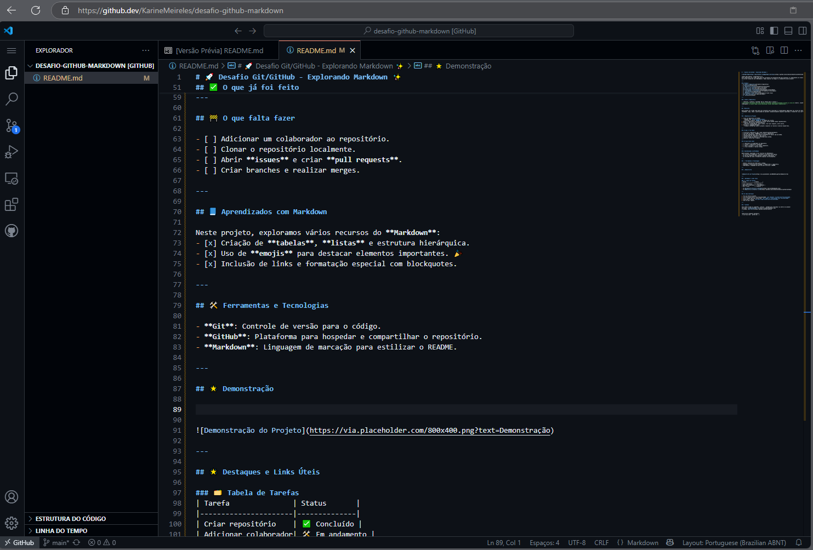

## Introdução ao propósito deste repositório e desta Documentação:


<br>
<p align="center"><b>
Este repositório foi criado como parte de um desafio proposto no curso da DIO sobre criação de documentações automáticas utilizando inteligência artificial. O objetivo foi demonstrar como ferramentas de IA podem auxiliar na elaboração de documentações técnicas claras, completas e organizadas.

</b></p>

<p align="center">
<br><br>Este fork do projeto original Mega Man Robots API foi realizado para:

<p align="center">
- Estudar e aprimorar a documentação existente.<br>
- Implementar melhorias e complementos, como:<BR>
<BR> - Estruturar as informações existentes para maior clareza e organização.<BR>- Adicionar uma tabela de conteúdo para facilitar a navegação.<BR> -Ampliar exemplos de uso e incluir seções como feedback e referências. <BR> - Sugerir melhorias futuras para expandir a documentação. <br> <br>
<p align="center">
As alterações realizadas neste repositório têm como foco garantir que a documentação seja útil tanto para desenvolvedores iniciantes quanto para experientes.

<p align="center">
<u>Toda a documentação originalmente em Inglês foi traduzida para o português.</u></p>

<p align="center">
  
</p>

--------------
<br>
<br>

<BR>

<p align="center">
  
</p>

<h1 align="center">Mega Man Robots API</h1>

<p align="center">
  <b>(MEGA-MAN-ROBOTS)</b>
</p>

<p align="center">
  <a href="https://github.com/felipeAguiarCode/MegaApiDotnetCore/actions/workflows/build.yml">
    
  </a>
  <a href="https://github.com/felipeAguiarCode/MegaApiDotnetCore/releases/latest">
    
  </a>
</p>


## Índice
- [Visão Geral](#visão-geral)
- [Endpoints da API](#endpoints-da-api)
- [Técnicas Utilizadas](#técnicas-utilizadas)
- [Dependências](#dependências)
- [Estrutura do Projeto](#estrutura-do-projeto)
- [Como Contribuir](#como-contribuir)
- [Licença](#licença)
- [Feedback](#feedback)
- [Referências](#referências)

<BR>

## Visão Geral

A **Mega Man Robots API** foi desenvolvida em .NET Core 3.1 para fornecer dados no formato JSON sobre os chefes da série Mega Man. Esta API backend foi projetada para ser funcional, eficiente e extensível.

<BR>

## Endpoints da API

| Método | Endpoint               | Descrição                                   |
|--------|------------------------|-------------------------------------------|
| GET    | /api/v1/robots         | Retorna uma lista de todos os robôs       |
| GET    | /api/v1/robots/{id}    | Retorna detalhes de um robô específico por ID |
| POST   | /api/v1/robots         | Cria um novo robô no sistema              |

<BR>

## Técnicas Utilizadas

- **Entity Framework Core**: Ferramenta ORM para gestão de dados.
- **Design RESTful**: Para comunicação clara e eficiente entre cliente e servidor.
- **Injeção de Dependência**: Para modularidade e testabilidade.

<BR>

## Dependências

| Pacote                           | Versão | Link                                   |
|----------------------------------|--------|---------------------------------------|
| Microsoft.EntityFrameworkCore    | 3.1.8  | [NuGet](https://www.nuget.org/packages/Microsoft.EntityFrameworkCore) |
| Microsoft.EntityFrameworkCore.Design | 3.1.8  | [NuGet](https://www.nuget.org/packages/Microsoft.EntityFrameworkCore.Design) |
| Microsoft.EntityFrameworkCore.SqlServer | 3.1.8  | [NuGet](https://www.nuget.org/packages/Microsoft.EntityFrameworkCore.SqlServer) |
| Newtonsoft.Json                  | 12.0.2 | [NuGet](https://www.nuget.org/packages/Newtonsoft.Json) |

<BR>

## Estrutura do Projeto


```🌐
src
├── 📂 Controllers      [Routes for endpoints]
├── 📂 Models           [Database models]
├── 📂 Services         [Business rules]
├── 📂 Middlewares      [Intermediate functions between the HTTP request and the final server response]
├── 📂 Database         [Structures related to the database]
│   ├── 📂 DTOs             [Input Models and View Models (Data Transfer Objects)]
│   ├── 📂 EntityFramework  [Files related to the ORM Entity Framework]
│   │     ├── 📂 Context         [Entity context settings]
│   │     ├── 📂 Migrations      [Migrations for database updates]
│   ├── 📂 Repositories     [Repository pattern]
```

<BR>

## Como Contribuir

- Faça um fork do repositório.
- Clone o repositório para sua máquina local:
  ```bash
  git clone https://github.com/seu-usuario/MegaApiDotnetCore.git
  ```
- Crie uma branch para suas alterações:
  ```bash
  git checkout -b minha-contribuicao
  ```
- Realize as alterações desejadas.
- Suba suas alterações:
  ```bash
  git push origin minha-contribuicao
  ```
- Abra um Pull Request no repositório principal.

<BR>

## Licença

Este projeto está licenciado sob os termos da licença [MIT](https://opensource.org/licenses/MIT).

<BR>

## Feedback

Se você tiver dúvidas, sugestões ou encontrar algum problema, sinta-se à vontade para abrir uma [issue](https://github.com/KarineMeireles/MegaApiDotnetCore/issues). Sua opinião é muito importante para melhorar este projeto!

<BR>

## Referências

- [Documentação oficial do Entity Framework Core](https://learn.microsoft.com/en-us/ef/core/)
- [Curso e Material DIO](https://dio.me/)

<BR>

## Fork:
<BR>

⌨️ FelipeAguiar -
[Github](https://github.com/felipeAguiarCode)
